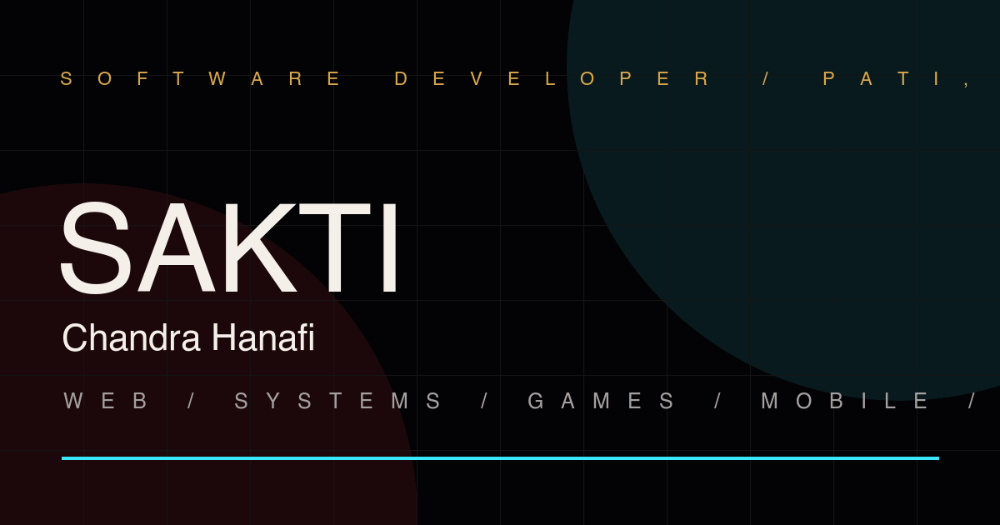

# Sakti Chandra Hanafi — Portfolio

Cinematic personal portfolio built with Vite, React, and TypeScript.

## Preview



### Stack

- Vite 6, React 18, TypeScript
- `wouter` for client-side routing (`/`, `/projects`)
- Curated portfolio data sourced from `src/lib/projects.ts`

## Run

```bash
npm install
npm run dev
```

Then open <http://localhost:5173>.

## Scripts

- `npm run dev` - start the Vite development server
- `npm run build` - production build to `dist/public`
- `npm run serve` - preview the built bundle
- `npm run typecheck` - `tsc --noEmit`
- `npm test` - run the Vitest suite once

## Structure

```
src/
  components/Portfolio.tsx   # main page
  components/portfolio.css   # all cinematic styling
  pages/Projects.tsx         # /projects - curated project archive
  lib/projects.ts            # portfolio project content
  lib/portfolio-data.test.ts # automated content integrity tests
  lib/skills.ts              # skill list + icon URLs (devicon / simpleicons)
  lib/seo.ts                 # per-route meta hook
.github/workflows/ci.yml     # typecheck, test, and build on GitHub Actions
vite.config.ts               # Vite build and resume synchronization
```

## License

See [LICENSE](./LICENSE) for the original codebase licensing terms.
